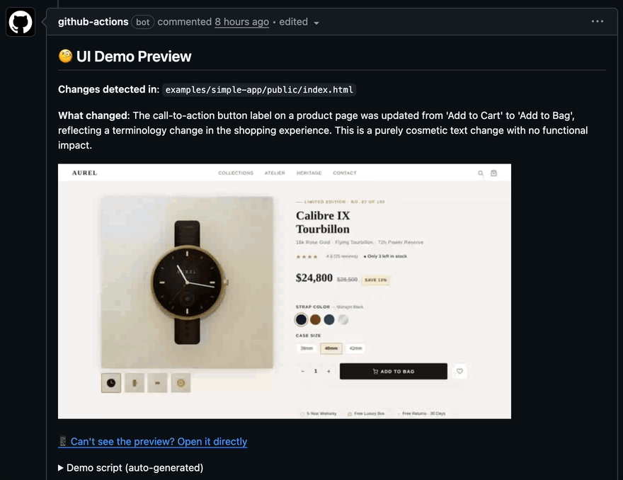

# GitGlimpse

Automatically generate visual demo clips of UI changes in pull requests.

When a PR is opened, GitGlimpse reads the diff, uses an LLM to understand what changed, generates a Playwright interaction script, records a demo, and posts it as a PR comment — all without leaving CI.



## How it works

```
PR opened/updated  (or /glimpse comment)
       │
       ▼
  Diff Analyzer ── identifies changed files and affected routes
       │
       ▼
  Script Generator ── LLM reads diff → generates Playwright script
       │
       ▼
  Recorder ── Playwright executes script + captures video
       │
       ▼
  Publisher ── FFmpeg converts to GIF, posts as PR comment
```

---

## Quick start

### 1. Add the workflow files

Two files are recommended. The first is the main pipeline; the second gives instant 👀 feedback on `/glimpse` comments without adding noise to PR push checks.

> **Note:** GitHub always reads `issue_comment` workflows from the **default branch** (main). Edits on feature branches are silently ignored for comment triggers — merge to main first for those changes to take effect. Action and core code changes are fine to test on branches.

**`.github/workflows/git-glimpse.yml`** — the main pipeline:

```yaml
name: GitGlimpse

on:
  pull_request:
    types: [opened, synchronize]
  issue_comment:
    types: [created]

jobs:
  demo:
    runs-on: ubuntu-latest
    if: >-
      github.event_name == 'pull_request' ||
      (github.event_name == 'issue_comment' &&
       github.event.issue.pull_request != null &&
       contains(github.event.comment.body, '/glimpse'))
    permissions:
      pull-requests: write
      contents: write       # required for uploading assets
      issues: write         # required for comment reactions

    steps:
      - uses: actions/checkout@v4
        with:
          fetch-depth: 0
          ref: ${{ github.event_name == 'issue_comment' && format('refs/pull/{0}/head', github.event.issue.number) || '' }}

      - uses: actions/setup-node@v4
        with:
          node-version: '20'

      - run: npm ci

      - name: Install FFmpeg
        run: sudo apt-get install -y ffmpeg

      - name: Install Playwright Chromium
        run: npx playwright install chromium --with-deps

      - uses: DeDuckProject/git-glimpse@v1
        env:
          ANTHROPIC_API_KEY: ${{ secrets.ANTHROPIC_API_KEY }}
          GITHUB_TOKEN: ${{ secrets.GITHUB_TOKEN }}

      - name: React with hooray on success
        if: github.event_name == 'issue_comment' && success()
        env:
          GH_TOKEN: ${{ secrets.GITHUB_TOKEN }}
        run: |
          gh api repos/$GITHUB_REPOSITORY/issues/comments/${{ github.event.comment.id }}/reactions \
            --method POST --field content=hooray || true

      - name: React with confused on failure
        if: github.event_name == 'issue_comment' && failure()
        env:
          GH_TOKEN: ${{ secrets.GITHUB_TOKEN }}
        run: |
          gh api repos/$GITHUB_REPOSITORY/issues/comments/${{ github.event.comment.id }}/reactions \
            --method POST --field content=confused || true
```

**`.github/workflows/git-glimpse-ack.yml`** — optional but recommended, reacts with 👀 within ~15–30s so the commenter knows their request was received before the heavy pipeline begins:

```yaml
name: GitGlimpse Acknowledge

on:
  issue_comment:
    types: [created]

jobs:
  ack:
    if: >-
      github.event.issue.pull_request != null &&
      contains(github.event.comment.body, '/glimpse')
    runs-on: ubuntu-latest
    permissions:
      issues: write
    steps:
      - name: React with eyes
        env:
          GH_TOKEN: ${{ secrets.GITHUB_TOKEN }}
        run: |
          gh api repos/$GITHUB_REPOSITORY/issues/comments/${{ github.event.comment.id }}/reactions \
            --method POST --field content=eyes || true
```

The ack workflow is kept separate so it never shows up as a "skipped" check on PR push events — which would add noise for non-developer reviewers.

### 2. Add a config file

```typescript
// git-glimpse.config.ts
import type { GitGlimpseConfig } from '@git-glimpse/core';

export default {
  app: {
    startCommand: 'npm run dev',
    readyWhen: { url: 'http://localhost:3000' },
  },
} satisfies GitGlimpseConfig;
```

### 3. Add secrets

In your repo: **Settings → Secrets and variables → Actions**

- `ANTHROPIC_API_KEY` — your Anthropic API key

That's it. Open a PR with UI changes and GitGlimpse will record and post a demo.

---

## Trigger modes

GitGlimpse supports three trigger modes that control when the pipeline runs.

### `auto` (default)

Runs automatically on every PR push that contains UI-relevant file changes.
Skips if no UI files changed and posts a comment explaining why, with instructions to force-run.

```typescript
export default {
  app: { startCommand: 'npm run dev' },
  trigger: {
    mode: 'auto',
  },
} satisfies GitGlimpseConfig;
```

### `on-demand`

Never runs automatically. Only runs when someone comments `/glimpse` on a PR.
Best for teams that want explicit control over when recordings are made, or for apps that are expensive to start.

```typescript
export default {
  app: { startCommand: 'npm run dev' },
  trigger: {
    mode: 'on-demand',
  },
} satisfies GitGlimpseConfig;
```

When a PR is pushed, GitGlimpse posts a skip comment:

> On-demand mode is enabled. Comment `/glimpse` on this PR to generate a demo.

### `smart`

Runs automatically, but only when the UI diff exceeds a line-change threshold.
Small tweaks (typos, color values, minor copy edits) are skipped; meaningful visual changes trigger a recording.

```typescript
export default {
  app: { startCommand: 'npm run dev' },
  trigger: {
    mode: 'smart',
    threshold: 20,   // min lines changed to trigger (default: 5)
  },
} satisfies GitGlimpseConfig;
```

### Comment commands

All trigger modes support `/glimpse` PR comments:

| Comment | Effect |
|---|---|
| `/glimpse` | Run the pipeline on this PR |
| `/glimpse --force` | Run even if no UI files changed |
| `/glimpse --route /products` | Record a specific route regardless of what changed |

The command prefix is configurable via `trigger.commentCommand` (default: `/glimpse`).

> **Note:** The `issue_comment` event must be included in your workflow trigger (as shown in the quick start) for comment commands to work. Add the optional `git-glimpse-ack.yml` workflow to give commenters immediate 👀 feedback before the heavy pipeline starts.

---

## Skip heavy steps with `check-trigger`

Installing FFmpeg and Playwright Chromium takes 2–4 minutes. When using `on-demand` or `smart` mode, many PR pushes would be skipped anyway. The `check-trigger` companion action evaluates the trigger decision first, for the cost of a few seconds, so you can gate the heavy installs on the result.

```yaml
jobs:
  demo:
    runs-on: ubuntu-latest
    if: >-
      github.event_name == 'pull_request' ||
      (github.event_name == 'issue_comment' &&
       github.event.issue.pull_request != null &&
       contains(github.event.comment.body, '/glimpse'))
    permissions:
      pull-requests: write
      contents: write
      issues: write

    steps:
      - uses: actions/checkout@v4
        with:
          fetch-depth: 0
          ref: ${{ github.event_name == 'issue_comment' && format('refs/pull/{0}/head', github.event.issue.number) || '' }}

      - run: npm ci

      # Lightweight check — runs in seconds
      - uses: DeDuckProject/git-glimpse/check-trigger@v1
        id: check
        env:
          GITHUB_TOKEN: ${{ secrets.GITHUB_TOKEN }}

      # Gate all heavy steps on the result
      - name: Install FFmpeg
        if: steps.check.outputs.should-run == 'true'
        run: sudo apt-get install -y ffmpeg

      - name: Cache Playwright browsers
        if: steps.check.outputs.should-run == 'true'
        uses: actions/cache@v4
        with:
          path: ~/.cache/ms-playwright
          key: playwright-chromium-${{ hashFiles('**/package-lock.json') }}
          restore-keys: playwright-chromium-

      - name: Install Playwright Chromium
        if: steps.check.outputs.should-run == 'true'
        run: npx playwright install chromium --with-deps

      - uses: DeDuckProject/git-glimpse@v1
        if: steps.check.outputs.should-run == 'true'
        env:
          ANTHROPIC_API_KEY: ${{ secrets.ANTHROPIC_API_KEY }}
          GITHUB_TOKEN: ${{ secrets.GITHUB_TOKEN }}

      - name: React with hooray on success
        if: github.event_name == 'issue_comment' && steps.check.outputs.should-run == 'true' && success()
        env:
          GH_TOKEN: ${{ secrets.GITHUB_TOKEN }}
        run: |
          gh api repos/$GITHUB_REPOSITORY/issues/comments/${{ github.event.comment.id }}/reactions \
            --method POST --field content=hooray || true

      - name: React with confused on failure
        if: github.event_name == 'issue_comment' && failure()
        env:
          GH_TOKEN: ${{ secrets.GITHUB_TOKEN }}
        run: |
          gh api repos/$GITHUB_REPOSITORY/issues/comments/${{ github.event.comment.id }}/reactions \
            --method POST --field content=confused || true
```

`check-trigger` outputs:

| Output | Values |
|---|---|
| `should-run` | `"true"` or `"false"` |

---

## With Vercel / Netlify deploy previews

If your app already has deploy previews, skip `startCommand` — point GitGlimpse at the preview URL instead:

```yaml
- name: Deploy to Vercel
  id: vercel
  uses: amondnet/vercel-action@v25
  with:
    vercel-token: ${{ secrets.VERCEL_TOKEN }}
    # ...

- uses: DeDuckProject/git-glimpse@v1
  with:
    preview-url: ${{ steps.vercel.outputs.preview-url }}
  env:
    ANTHROPIC_API_KEY: ${{ secrets.ANTHROPIC_API_KEY }}
    GITHUB_TOKEN: ${{ secrets.GITHUB_TOKEN }}
```

```typescript
export default {
  app: {
    previewUrl: 'VERCEL_URL',  // env var name — or a literal URL
  },
} satisfies GitGlimpseConfig;
```

---

## CLI (local use)

```bash
# Run on your current changes
npx git-glimpse run --diff HEAD~1 --url http://localhost:3000 --open

# Initialize a config file
npx git-glimpse init
```

---

## Full configuration reference

```typescript
// git-glimpse.config.ts
import type { GitGlimpseConfig } from '@git-glimpse/core';

export default {
  // ── App startup ───────────────────────────────────────────────────────────
  app: {
    // Option A: GitGlimpse starts your app
    startCommand: 'npm run dev',
    readyWhen: {
      url: 'http://localhost:3000',   // poll this URL until it responds
      status: 200,                    // expected status code (default: 200)
      timeout: 30000,                 // ms before giving up (default: 30000)
    },
    env: { DATABASE_URL: 'sqlite::memory:' },  // extra env vars for startCommand

    // Option B: Use an existing deploy preview
    // previewUrl: 'VERCEL_URL',      // env var name or literal URL
  },

  // ── Trigger ───────────────────────────────────────────────────────────────
  trigger: {
    mode: 'auto',            // 'auto' | 'on-demand' | 'smart'  (default: 'auto')
    threshold: 5,            // smart mode: min lines changed to trigger (default: 5)
    include: ['src/**', 'app/**'],            // only count these files as UI-relevant
    exclude: ['**/*.test.*', '**/*.spec.*'],  // always skip these files
    commentCommand: '/glimpse',   // PR comment command (default: '/glimpse')
    skipComment: true,            // post a comment when skipping (default: true)
  },

  // ── Route map (optional, improves LLM accuracy) ───────────────────────────
  // Maps source file globs → URLs where changes are visible.
  // Useful for shared components, Liquid templates, Shopify extensions, etc.
  routeMap: {
    'app/routes/products.$id.tsx': '/products/sample-product',
    'src/components/Header.tsx': '/',
    'extensions/my-block/**': '/products/sample-product',
  },

  // ── Setup (optional) ──────────────────────────────────────────────────────
  // Shell command to run before recording (e.g. seed the database)
  setup: 'node scripts/seed.js',

  // ── Recording ─────────────────────────────────────────────────────────────
  recording: {
    format: 'gif',                     // 'gif' | 'mp4' | 'webm'  (default: 'gif')
    maxDuration: 30,                   // seconds  (default: 30)
    viewport: { width: 1280, height: 720 },
    deviceScaleFactor: 2,              // 2 = retina/HiDPI  (default: 2)
    showMouseClicks: true,             // highlight clicks in recording
  },

  // ── LLM ───────────────────────────────────────────────────────────────────
  llm: {
    provider: 'anthropic',             // 'anthropic' | 'openai'
    model: 'claude-sonnet-4-6',        // or 'gpt-4o', etc.
  },
} satisfies GitGlimpseConfig;
```

### Action inputs

| Input | Default | Description |
|---|---|---|
| `config-path` | `git-glimpse.config.ts` | Path to config file |
| `preview-url` | — | External preview URL (overrides config) |
| `start-command` | — | App start command (overrides config) |
| `trigger-mode` | _(from config)_ | Override trigger mode: `auto`, `on-demand`, or `smart` |
| `format` | `gif` | Output format: `gif`, `mp4`, `webm` |
| `max-duration` | `30` | Max recording duration in seconds |

### Action outputs

| Output | Description |
|---|---|
| `recording-url` | URL of the uploaded recording artifact |
| `comment-url` | URL of the posted PR comment |
| `success` | Whether recording succeeded (`true`/`false`) |

---

## Route detection

GitGlimpse automatically maps changed files to URLs using framework conventions:

| Framework | Convention | Example |
|---|---|---|
| Remix | `app/routes/products.$id.tsx` | `/products/:id` |
| Next.js App Router | `app/products/[id]/page.tsx` | `/products/:id` |
| Next.js Pages Router | `pages/products/[id].tsx` | `/products/:id` |
| SvelteKit | `src/routes/products/[id]/+page.svelte` | `/products/:id` |

For files outside these conventions, use `routeMap` in the config to explicitly map them.

---

## Retry and fallback behavior

If the generated Playwright script fails (element not found, timeout, etc.), GitGlimpse:

1. Retries up to 2 times, feeding the error back to the LLM for a revised script
2. Falls back to static screenshots if all attempts fail

The PR comment is always posted — with a GIF if recording succeeded, or screenshots as a fallback.

---

## Requirements

- **Node.js** ≥ 20
- **Anthropic API key** — set as `ANTHROPIC_API_KEY` environment variable
- **FFmpeg** — required for GIF/MP4 conversion
  - GitHub Actions: `sudo apt-get install -y ffmpeg`
  - macOS: `brew install ffmpeg`
  - Ubuntu/Debian: `sudo apt-get install -y ffmpeg`
- **Playwright Chromium** — `npx playwright install chromium --with-deps`

---

## Development

```bash
pnpm install
pnpm build
pnpm test                   # unit tests
pnpm run test:integration   # Playwright + FFmpeg tests (no API key needed)
pnpm run test:llm           # full pipeline with real LLM (requires ANTHROPIC_API_KEY)
```

See [CLAUDE.md](CLAUDE.md) for repo structure and contributor notes.

---

## License

MIT
